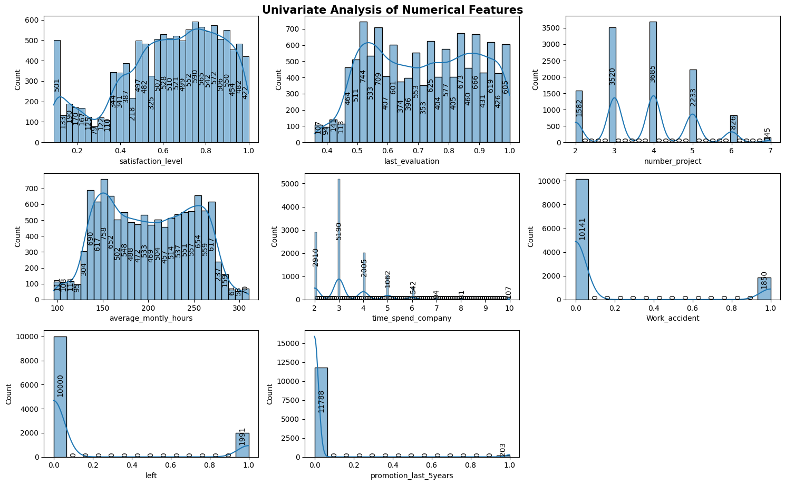

# 🧠 Employee Churn Prediction

## 📘 Overview

This project focuses on predicting **employee churn** using structured HR data. A XGBoost Classifier is used to model the likelihood of an employee leaving the company, based on various features such as satisfaction level, average monthly hours, promotion history, department, salary level and more.

To enhance model accuracy and prevent overfitting, the pipeline includes **feature encoding**, **standardization**, and **oversampling** using **SMOTE**.

---

## 🎯 Problem Statement

> Employee attrition poses a critical challenge to organizational stability and growth. This project aims to develop a machine learning model that predicts whether an employee is likely to leave the company based on HR-related numerical and categorical features. The objective is to support HR in proactively addressing employee dissatisfaction and improving retention strategies.

---

## 🗃️ Dataset

- Contains features like:
  - `satisfaction_level`
  - `last_evaluation`
  - `number_project`
  - `average_monthly_hours`
  - `time_spend_company`
  - `work_accident`
  - `promotion_last_5years`
  - `salary` (categorical)
  - `department` (categorical)

- Target variable:
  - `left` (1 = employee left, 0 = employee stayed)

---

## 📁 Project Directory Structure

EMPLOYEE CHURN PREDICTION/
│
├── 📁 artifacts/           # Preprocessed data and split into train and test datasets, with model and preprocessor files              
│   ├── data.csv
│   └── model.pkl
│   └── preprocessor.pkl
│   └── test.csv
│   └── train.csv
│
├── 📁 Employee_Churn_Prediction.egg-info/                   # Stores dependencies and packages
│   └── dependency_links.txt
│   └── PKG-INFO
│   └── requires.txt
│   └── SOURCES.txt
│   └── top_level.txt
|
├── 📁 logs/            # Logs folder
|
├── 📁 notebook/                                               # Jupyter notebooks and raw dataset
│   └── 1. EDA-Employee Churn.ipynb
│   └── 2. Model Training - Employee Churn Prediction.ipynb
│   └── HR_dataset.csv
│
├── 📁 src/                       # Source code for pipeline and components
│   └── __pycache__/
│   ├── components/                # Data ingestion, data transformation, model training
│   ├── pipeline/                  # Prediction pipeline
│   ├── exception.py               # Exceptions
│   ├── logger.py                  # Logging
│   ├── utils.py                   # Utility functions
│   └── __init__.py
│
├── 📁 templates/                  # HTML files for Flask frontend
│   └── index.html
│   └── home.html
│
├── 📁 visuals/                   # Images of visulizations in EDA
│
├── app.py                         # Flask app script
├── requirements.txt               # Python dependencies
├── setup.py                       # Package setup file
├── README.md                      # Project documentation

---

## 🧪 Model Pipeline

1. **EDA**
   - Data Preprocessing and Cleaning
   - Made key insights about the characteristics of data
   - Visualized relationships between features and identified key factors influencing employee churn 
     
2. **Preprocessing**
   - One-Hot Encoding for `department` and `salary`
   - Standardization for numerical features
   - Oversampled the minority class using SMOTE.

3. **Model Training**
   - Trained 5+ classification models on the processed data
   - Evaluated models on metrics such as accuracy, precision, recall, f1 score etc.
   - Selected the best model - RandomForestClassifier in terms of f1 score.
   
---

## 📊 Performance Metrics

- **Accuracy**: 98%
- **Precision**: 97%
- **Recall**: 90%
- **F1 Score**: 93%

> Metrics evaluated on a test set.

---

## 🛠️ Tech Stack

- Python
- Scikit-learn, Imbalanced-learn
- Pandas, NumPy
- Matplotlib, Seaborn
- Flask
- Jupyter Notebook

---

## 📊 Visualizations Used

Here are some sample visualizations in the EDA notebook:-

## Flask App Interface

---

## 📌 Conclusion

This project demonstrates how structured HR data combined with a well-tuned model can effectively predict employee attrition, enabling organizations to take preventive retention actions based on data-driven insights.

## 👤 Author
Aditya Jain
📧 [meaditya1103@gmail.com]
🔗 [www.linkedin.com/in/adityajain8595/]
